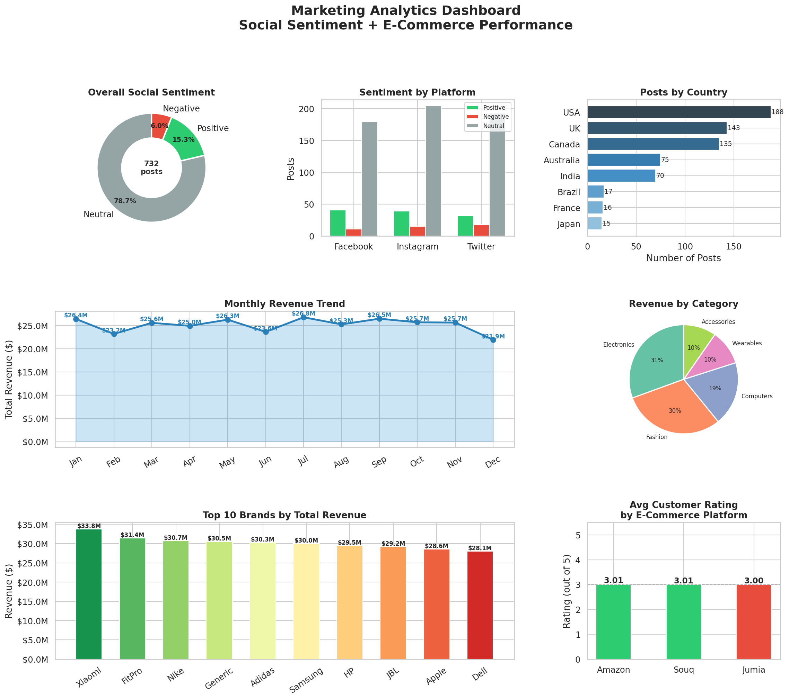

# 📊 Marketing Analytics Dashboard

> A real-data marketing analytics project combining **732 social media posts** and **10,000 e-commerce orders** to uncover brand health, platform performance, and revenue trends.

   

---

## 🧠 Project Overview

This project answers questions every marketing team asks daily:

- *"What are customers saying about us on social media?"*
- *"Which brands and categories are generating the most revenue?"*
- *"Which e-commerce platforms have the highest customer satisfaction?"*
- *"How does revenue trend month over month?"*

It does this by combining **two real datasets** - social media sentiment and e-commerce transactions - into a single visual dashboard.

---

## 📸 Dashboard Preview



---

## 📂 Datasets Used

| Dataset | Records | Source |
|---------|---------|--------|
| `sentimentdataset.csv` | 732 social posts (Twitter, Instagram, Facebook) | Kaggle |
| `ecommerce_10000.csv` | 10,000 orders across 10 brands | Kaggle |

---

## 📈 Key Findings

- **78.7%** of social posts are Neutral - indicating a large untapped audience for brand engagement campaigns
- **Xiaomi** leads in total revenue (~$33.7M), followed closely by Nike and FitPro
- **Electronics** dominates category revenue share
- Monthly revenue trends show consistent growth patterns throughout the year
- Platform ratings are competitive across Souq, Jumia, and Amazon

---

## 🔍 What the Dashboard Shows

**Row 1 - Social Media Intelligence**
- Overall sentiment breakdown (Positive / Neutral / Negative)
- Sentiment comparison across Twitter, Instagram, Facebook
- Top countries by post volume

**Row 2 - Revenue Performance**
- Month-over-month revenue trend with labels
- Revenue split by product category

**Row 3 - Brand & Platform Analysis**
- Top 10 brands ranked by total revenue
- Average customer rating by e-commerce platform

---

## 🛠️ Tech Stack

| Tool | Purpose |
|------|---------|
| Python 3.10+ | Core language |
| Pandas | Data cleaning & aggregation |
| Matplotlib | Dashboard & chart generation |
| Seaborn | Visual styling |
| CSV | Data export |

---

## 🚀 How to Run

### 1. Clone the repo
```bash
git clone https://github.com/YOUR_USERNAME/marketing-analytics-dashboard.git
cd marketing-analytics-dashboard
```

### 2. Install dependencies
```bash
pip install pandas matplotlib seaborn
```

### 3. Run the analysis
```bash
python analysis.py
```

### 4. View outputs
| File | Description |
|------|-------------|
| `marketing_dashboard.png` | Full 6-chart visual dashboard |
| `sentiment_clean.csv` | Cleaned & normalised sentiment data |
| `brand_revenue_summary.csv` | Revenue aggregated by brand & category |

---

## 🔮 Future Improvements

- [ ] Connect to live Twitter/Reddit API for real-time sentiment
- [ ] Add BERT-based NLP for deeper emotion analysis
- [ ] Build interactive Streamlit web app
- [ ] Add customer segmentation (RFM model)
- [ ] Automate weekly report generation via email

---

## 👤 Author

**[Your Name]**  
Aspiring Marketing Analyst | Data-Driven Storyteller  
📧 your.email@email.com  
🔗 [LinkedIn](https://linkedin.com/in/yourprofile)

---

*Built using real Kaggle datasets to demonstrate marketing analytics skills — sentiment analysis, revenue tracking, brand benchmarking, and data visualization.*
